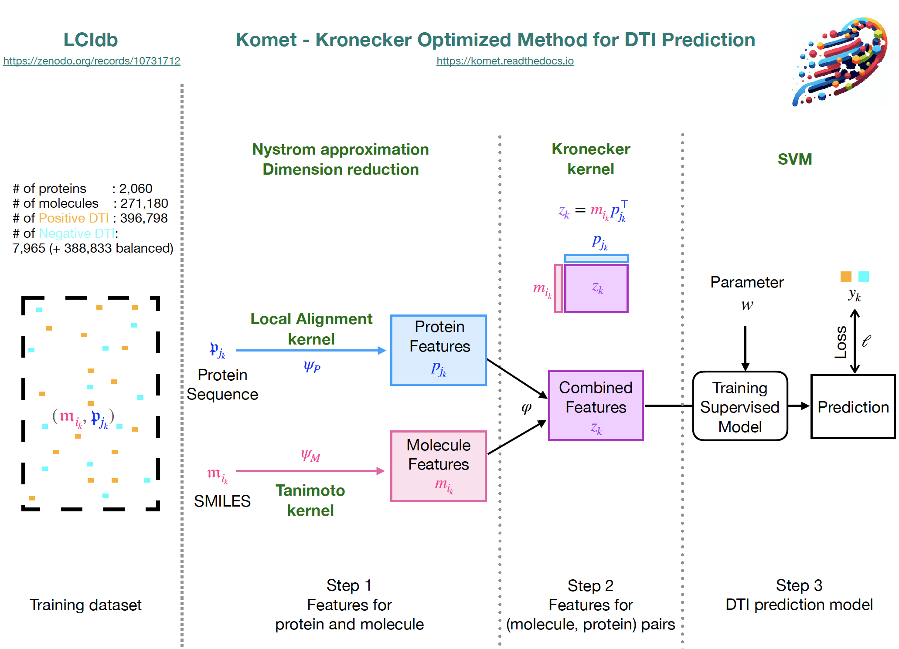

.. komet documentation master file, created by
   sphinx-quickstart on Sun Feb 18 12:55:08 2024.
   You can adapt this file completely to your liking, but it should at least
   contain the root `toctree` directive.

Komet - Kronecker Optimized Method for DTI Prediction
=====================================================

   
.. toctree::
   :hidden:
   :maxdepth: 1
   :glob:
   :caption: Getting started

   vignettes/*

.. toctree::
   :hidden: 
   :maxdepth: 3
   :caption: API

   komet
   

Overview
--------

This library is designed for computational biology and cheminformatics, focusing on the prediction and analysis of molecular interactions. It provides tools for loading and processing molecular and protein data, computing molecular fingerprints, estimating interaction probabilities, and evaluating model performance. This suite is particularly useful for researchers and developers working in drug discovery and molecular docking simulations.

Citation
--------

If you use this library, please be sure to cite::

   @article{Komet2024,
     title={Advancing Drug-Target Interactions Prediction: Leveraging a Large-Scale Dataset with a Rapid and Robust Chemogenomic Algorithm},
     author={Gwenn Guichaoua, Philippe Pinel, Brice Hoffmann, Chloé-Agathe Azencott, Véronique Stoven},
     journal={BioRxiv},
      year={2024},
     doi={10.1101/2024.02.22.581599},
     url={https://www.biorxiv.org/content/10.1101/2024.02.22.581599v1},
     abstract={Predicting drug-target interactions (DTIs) is crucial for drug discovery, and heavily relies on supervised learning techniques. In the context of DTI prediction, supervised learning algorithms use known DTIs to learn associations between molecule and protein features, allowing for the prediction of new interactions based on learned patterns. In this paper, we present a novel approach addressing two key challenges in DTI prediction: the availability of large, high-quality training datasets and the scalability of prediction methods. First, we introduce LCIdb, a curated, large-sized dataset of DTIs, offering extensive coverage of both the molecule and druggable protein spaces. Notably, LCIdbcontains a much higher number of molecules, expanding coverage of the molecule space compared to traditional benchmarks. Second, we propose Komet (Kronecker Optimized METhod), a DTI prediction pipeline designed for scalability without compromising performance. Komet leverages a three-step framework, incorporating efficient computation choices tailored for large datasets and involving the Nyström approximation. Specifically, Komet employs a Kronecker interaction module for (molecule, protein) pairs, which is sufficiently expressive and whose structure allows for reduced computational complexity. Our method is implemented in open-source software, lever-aging GPU parallel computation for efficiency. We demonstrate the efficiency of our approach on various datasets, showing that Komet displays superior scalability and prediction performance compared to state-of-the-art deep-learning approaches. Additionally, we illustrate the generalization properties of Komet by showing its ability to solve challenging scaffold-hopping problems gathered in the publicly available LH benchmark. Komet is available open source at https://komet.readthedocs.io.}

Dependencies
------------

The library requires the following Python packages:

- pandas
- numpy
- rdkit
- torch
- scikit-learn
- zipp
- pickle
- os

Installation
------------

To install the required dependencies, run::

   pip install pandas numpy rdkit-pypi torch scikit-learn

Functionalities
---------------

Preprocessing and Data Loading
~~~~~~~~~~~~~~~~~~~~~~~~~~~~~~

- ``process_LCIdb(name_file, data_dir, max_length_fasta, bioactivity_choice, min_weight, max_weight, interaction_plus, interaction_minus)``: Process dataset from 'Consensus_CompoundBioactivity_Dataset_v1.1.csv' 
- ``load_df(name)``: Loads a dataframe from a CSV file, cleans up SMILES strings that cannot be read by RDKit.
- ``add_indsmiles(df)``: Adds indices for each unique SMILES string in the dataframe.
- ``add_indfasta(df)``: Adds an index column for each unique FASTA sequence in the dataframe.

Molecular Features Computation
~~~~~~~~~~~~~~~~~~~~~~~~~~~~~~

- ``Morgan_FP(list_smiles)``: Computes the Morgan fingerprints for a list of SMILES strings.
- ``Nystrom_X(smiles_list, S, MorganFP, V, rM, Mu, epsi)``: Computes the approximate features of the molecular kernel using the Nystrom approximation.

Model Training and Prediction
~~~~~~~~~~~~~~~~~~~~~~~~~~~~~

- ``SVM_bfgs(X_cn, Y_cn, y, I, J, lamb)``: Trains an SVM model using the L-BFGS optimization algorithm.
- ``compute_proba_Platt_Scalling(w_bfgs, X_cn, Y_cn, y, I, J)``: Computes probability estimates for interaction predictions using Platt scaling.
- ``compute_proba(w_bfgs, b_bfgs, s, t, X_cn, Y_cn, I, J)``: Computes probabilities using the trained weights and Platt scaling parameters.

Evaluation
~~~~~~~~~~

- ``results(y, y_pred, proba_pred)``: Computes and returns various performance metrics of the model.

Data Splitting Functions : Functions to split interaction matrices into training, testing, and validation sets ensuring proper separation and balance
~~~~~~~~~~

- ``make_train_test_val_S1(df, train_ratio, test_ratio)``: Splits the input DataFrame into training, testing, and validation datasets.
- ``make_train_test_val_S2(df)``: Splits the interaction matrix into training, testing, and validation sets, ensuring there is no overlap
    between the molecules in the training set and those in the testing or validation sets (Unseen_drugs scenario).
- ``make_train_test_val_S3(df)``: Splits the interaction matrix into training, testing, and validation sets, ensuring there is no overlap
    between the proteins in the training set and those in the testing or validation sets (Unseen_targets scenario).
- ``make_train_test_val_S4(df)``: Splits the interaction matrix into balanced training, testing, and validation sets ensuring there is no 
    overlap between the proteins and molecules in the training set compared to those in the testing and 
    validation sets (Orphan).
- ``make_CV_train_test(load_data, S, save_data, nb_folds)``: Loads the interaction data from a CSV file, preprocesses the data to generate 
    numerical indices for unique smiles (molecules) and fasta (proteins), and splits the data into cross-validation training and testing 
    datasets based on the specified split type.
- ``make_CV_train_test_full(df, nb_folds, path_mkdir)``: Splits the input DataFrame into cross-validation training and testing datasets.
- ``make_CV_train_test_unseen_drug(df, nb_folds, path_mkdir)``: Splits the interaction matrix into cross-validation training and testing datasets, 
    ensuring that the molecules in the test set are not present in the train set (Unseen_drugs scenario).
- ``make_CV_train_test_unseen_target(df, nb_folds, path_mkdir)``: Splits the interaction matrix into cross-validation training and testing datasets,
      ensuring that the proteins in the test set are not present in the train set (Unseen_targets scenario).
- ``make_CV_train_test_Orphan(df, nb_folds, path_mkdir)``: Splits the input DataFrame into cross-validation training and testing datasets, 
    ensuring that the proteins and molecules in the test set are not present in the train set. 

Utility Functions : Nearest Neighbor SVM model versus Komet model
~~~~~~~~~~

- ``NN_ST_SVM(data_set,mM,dM,lbda)``: Trains a nearest neighbor SVM model for each protein and evaluates its performance.
- ``MT_Komet(data_set,lambda_list,mM,dM)``: Trains a Komet model  for each protein and evaluates its performance.

Example Usage
-------------

.. code-block:: python

   import pandas as pd
   import komet

   # Load your dataset
   df = komet.process_LCIdb('Consensus_CompoundBioactivity_Dataset_v1.1.csv', 'data', 1000, 'checkand1database', 0, 10000, 1, 0)

Contributing
------------

We welcome contributions to this library. If you have suggestions for improvements or bug fixes, please open an issue or a pull request.

License
-------

`MIT License <_static/LICENSE>`_ 

Indices and tables
==================

* :ref:`genindex`
* :ref:`modindex`
* :ref:`search`